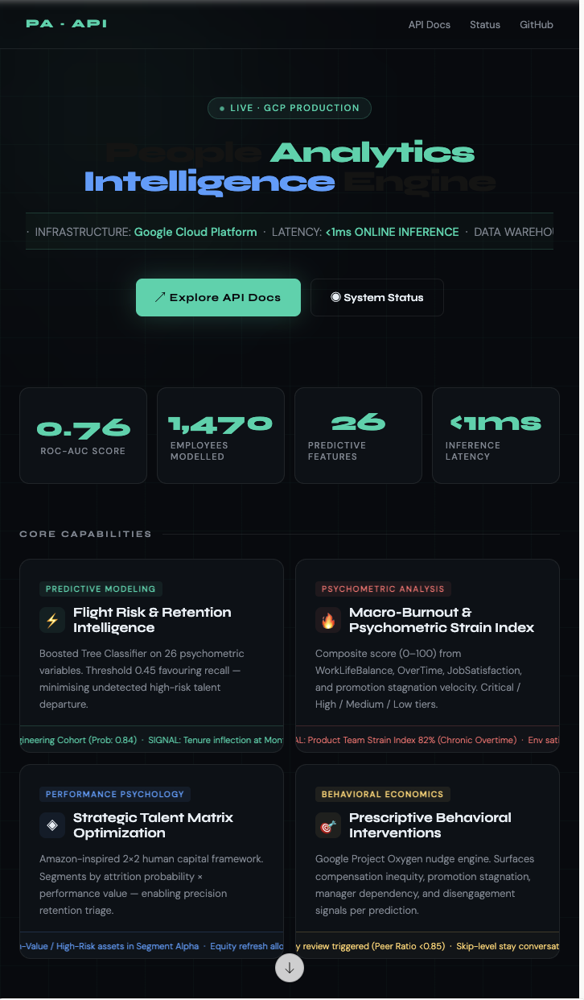
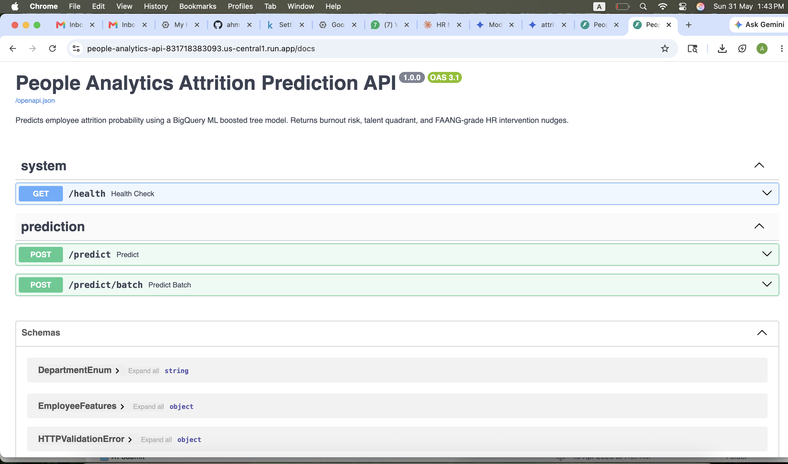

# People Analytics Intelligence Engine
### End-to-End MLOps & Prescriptive Behavioral Science Pipeline on GCP

[](https://github.com/ahmeraza/people-analytics-gcp/actions/workflows/ci.yml)
[](https://www.python.org/downloads/release/python-311/)
[](LICENSE)
[](https://fastapi.tiangolo.com/)
[](https://cloud.google.com/bigquery-ml)
[](https://people-analytics-api-831718383093.us-central1.run.app)

> **🌐 Live API:** https://people-analytics-api-831718383093.us-central1.run.app
> **📖 API Docs:** https://people-analytics-api-831718383093.us-central1.run.app/docs
> **💻 GitHub:** https://github.com/ahmeraza/people-analytics-gcp

An enterprise-grade workforce intelligence engine that transforms raw HR data into prescriptive behavioral interventions — built entirely on Google Cloud Platform with production-grade MLOps, FAANG People Science methodology, and a sub-millisecond REST API deployed to Cloud Run.

This is not a tutorial project. Every component — from the deterministic data split to the Pydantic v2 schema validation to the burnout index weighting — reflects deliberate engineering decisions made under real production constraints at minimal cost.

---

## Live Screenshots

| Landing Page | API Response with FAANG Nudges |
|:---:|:---:|
|  |  |

---

## Architecture

```
╔══════════════════════════════════════════════════════════════════════════╗
║                       DATA ENGINEERING LAYER                            ║
║                                                                          ║
║  IBM Watson HR Dataset (Kaggle · 1,470 employees · 35 raw features)    ║
║         │                                                                ║
║         ▼                                                                ║
║  Cloud Storage ─────────────────────────────────────────────────────►  ║
║  (Immutable raw data lake landing zone)                                 ║
║         │                                                                ║
║         ▼                                                                ║
║  BigQuery — SQL Transform Layer                                          ║
║  ├── BOOL type casting (autodetect schema fix)                          ║
║  ├── FARM_FINGERPRINT deterministic 80/20 train-eval split              ║
║  ├── Categorical encoding: dept · role · marital · education            ║
║  └── FAANG Compound Feature Engineering:                                ║
║      ├── Internal Equity Ratio    MonthlyIncome / AVG OVER peer cohort  ║
║      ├── Promotion Stagnation Index  YearsAtCompany / promotion rate    ║
║      └── Manager Dependency Score   manager tenure / company tenure     ║
╠══════════════════════════════════════════════════════════════════════════╣
║                         ML TRAINING LAYER                               ║
║                                                                          ║
║  BigQuery ML — In-database training (no data egress · zero GPU cost)   ║
║  ├── Model 1: Logistic Regression (baseline · interpretable · L1+L2)   ║
║  └── Model 2: XGBoost Boosted Trees (primary · HIST · early stopping)  ║
║         │                                                                ║
║         ▼                                                                ║
║  Vertex AI Model Registry                                                ║
║  └── Version control · lineage tracking · deployment governance         ║
╠══════════════════════════════════════════════════════════════════════════╣
║                        ANALYTICS LAYER                                  ║
║                                                                          ║
║  BigQuery Views — FAANG-grade People Science analytics                  ║
║  ├── v_burnout_risk         Psychometric Strain Index per employee      ║
║  ├── v_attrition_segmented  Talent Matrix + Regretted Attrition         ║
║  └── v_manager_effectiveness Manager Effectiveness Score by cohort      ║
║         │                                                                ║
║         ▼                                                                ║
║  Looker Studio — 4 live dashboards (BigQuery native · free)             ║
╠══════════════════════════════════════════════════════════════════════════╣
║                         SERVING LAYER                                   ║
║                                                                          ║
║  Cloud Run + FastAPI REST API (serverless · scales to zero)             ║
║  ├── GET  /          Custom HTML landing page (dark theme · animations) ║
║  ├── POST /predict   Single employee risk assessment  <1ms latency      ║
║  ├── POST /predict/batch  Batch scoring up to 50 employees              ║
║  └── GET  /health    Liveness probe for Cloud Run health checks         ║
║         │                                                                ║
║         ▼                                                                ║
║  {                                                                       ║
║    "attrition_probability": 0.78,                                       ║
║    "prediction": "High Risk",                                           ║
║    "burnout_risk_index": 97.2,                                          ║
║    "burnout_tier": "Critical",                                          ║
║    "talent_quadrant": "High Risk / High Value",                         ║
║    "nudges": ["Review overtime immediately", "Comp equity review..."]   ║
║  }                                                                       ║
╠══════════════════════════════════════════════════════════════════════════╣
║                      OBSERVABILITY LAYER                                ║
║  Cloud Logging (structured JSON) · Cloud Monitoring · GitHub Actions CI ║
╚══════════════════════════════════════════════════════════════════════════╝
```

---

## GCP Services & Cost Architecture

| Service | Role in Pipeline | Cost |
|---|---|---|
| **Cloud Storage** | Raw data lake landing zone + model artifact persistence | 5 GB always free |
| **BigQuery** | Massively parallel SQL transforms + analytical warehouse | 1 TB queries/month free |
| **BigQuery ML** | In-database XGBoost + Logistic Regression training | ~$0 for 1,470 rows |
| **Vertex AI Model Registry** | Model versioning, lineage, deployment governance | $300 credit |
| **Vertex AI Endpoint** | Online inference node — live for 30 min testing, then deleted | ~$0.18 total |
| **Cloud Run** | Serverless FastAPI container, scales to zero | 2M requests/month free |
| **Cloud Build + Artifact Registry** | Docker image build + storage | 120 build-min/day free |
| **Cloud Logging** | Structured JSON prediction logs, queryable with log-based metrics | 50 GB/month free |
| **Looker Studio** | Native BigQuery dashboarding for HR executives | Free |
| **Total Project Cost** | | **~$2 from $300 credit** |

> Cost efficiency is a first-class architectural constraint here — not an afterthought. BQML trains inside BigQuery where data already lives (zero egress). Cloud Run bills only on requests. The Vertex endpoint ran for 30 minutes of testing and was immediately deleted.

---

## Repository Structure

```
people-analytics-gcp/
├── data/
│   └── WA_Fn-UseC_-HR-Employee-Attrition.csv   # IBM Watson HR dataset (Kaggle)
├── pipeline/
│   ├── ingest.py                # GCS upload + BigQuery load + SQL feature transforms
│   ├── train.sql                # BQML CREATE MODEL: logistic regression + XGBoost
│   ├── train_runner.py          # Executes SQL, logs metrics, saves eval_metrics.json
│   ├── deploy_vertex.py         # Vertex AI Model Registry + endpoint deployment
│   ├── predict.py               # Batch prediction via ML.PREDICT (no endpoint needed)
│   ├── analytics_views.sql      # 3 FAANG-grade BigQuery analytical views
│   └── analytics_runner.py      # Creates all 3 views with SQL comment stripping
├── api/
│   ├── main.py                  # FastAPI: predict, batch, health, landing page
│   ├── Dockerfile               # Multi-stage build, non-root user, <150MB image
│   └── requirements.txt         # Pinned API dependencies
├── infra/
│   └── setup.sh                 # One-command GCP bootstrap: APIs + IAM + bucket + dataset
├── tests/
│   ├── test_api.py              # 30+ unit tests, Vertex AI mocked, no credentials needed
│   └── test_pipeline.py         # Pipeline validation + SQL content checks
├── docs/
│   └── screenshots/             # Landing page + API response screenshots
├── .github/
│   └── workflows/
│       └── ci.yml               # Ruff lint + pytest + Docker build check on every push
├── .env.example                 # Required environment variable template
└── README.md
```

---

## Quickstart

### Prerequisites

- Python 3.11 — use `python3.11 -m venv .venv` (3.12/3.13 cause pandas import issues on Mac)
- [Google Cloud SDK](https://cloud.google.com/sdk/docs/install) — run `gcloud auth application-default login` after install
- [Kaggle API token](https://www.kaggle.com/docs/api) — place at `~/.kaggle/kaggle.json`
- GCP project with billing enabled and $300 free credit attached

> **Mac users:** If using Conda, disable auto-activation first: `conda config --set auto_activate_base false`. The `(base)` environment overrides `.venv` and causes `ImportError` even when packages are correctly installed.

### 1. Clone and configure

```bash
git clone https://github.com/ahmeraza/people-analytics-gcp.git
cd people-analytics-gcp

cat > .env << 'EOF'
GCP_PROJECT_ID=your-gcp-project-id
GCS_BUCKET=your-globally-unique-bucket-name
BQ_DATASET=attrition
GCP_REGION=us-central1
MODEL_VERSION=v1
EOF
```

### 2. Set up Python environment

```bash
python3.11 -m venv .venv
source .venv/bin/activate        # Windows: .venv\Scripts\activate

pip3 install -r requirements.txt
```

### 3. Bootstrap GCP infrastructure

```bash
chmod +x infra/setup.sh
./infra/setup.sh
# Enables 8 APIs · creates GCS bucket · BigQuery dataset · service account + IAM roles
```

### 4. Download dataset and ingest

```bash
mkdir data
kaggle datasets download -d pavansubhasht/ibm-hr-analytics-attrition-dataset -p data/ --unzip

python3 pipeline/ingest.py
# → Uploads to GCS → loads to BigQuery → SQL transforms → 80/20 split
```

Verify in BigQuery Studio:
```sql
SELECT data_split, label, COUNT(*) as n
FROM `your-project.attrition.attrition_clean`
GROUP BY 1, 2 ORDER BY 1, 2
-- Expected: EVAL|0|252  EVAL|1|45  TRAIN|0|981  TRAIN|1|192
```

### 5. Train both models

```bash
python3 pipeline/train_runner.py
# Logistic regression ~1 min · Boosted trees ~18 min
# Do not Ctrl+C — the GCP job continues even if local script is killed
```

### 6. Create FAANG analytics views

```bash
python3 pipeline/analytics_runner.py
# Creates v_burnout_risk · v_attrition_segmented · v_manager_effectiveness
```

### 7. Deploy to Vertex AI

```bash
python3 pipeline/deploy_vertex.py
# Note the endpoint ID — add VERTEX_ENDPOINT_ID=<id> to .env

# DELETE IMMEDIATELY after testing to stop billing ($0.35/hr):
python3 pipeline/deploy_vertex.py --delete-endpoint
```

### 8. Deploy API to Cloud Run

```bash
gcloud run deploy people-analytics-api \
  --source api/ \
  --region us-central1 \
  --allow-unauthenticated \
  --set-env-vars GCP_PROJECT_ID=your-project,MODEL_VERSION=v1
```

### 9. Test the live API

```bash
curl -X POST https://YOUR_CLOUD_RUN_URL/predict \
  -H "Content-Type: application/json" \
  -d '{
    "Age": 35, "MonthlyIncome": 3000, "YearsAtCompany": 5,
    "JobSatisfaction": 2, "WorkLifeBalance": 1,
    "PerformanceRating": 3, "JobLevel": 3,
    "internal_equity_ratio": 0.82,
    "promotion_stagnation_index": 4.2,
    "manager_dependency_score": 0.6
  }'
```

```json
{
  "attrition_probability": 0.78,
  "prediction": "High Risk",
  "burnout_risk_index": 97.2,
  "burnout_tier": "Critical",
  "talent_quadrant": "High Risk / High Value",
  "nudges": [
    "Perform out-of-cycle compensation equity review vs peer cohort.",
    "Initiate career development conversation — promotion stagnation detected.",
    "Schedule skip-level check-in — disengagement pattern detected.",
    "Assess workplace environment — satisfaction below threshold."
  ],
  "threshold_used": 0.45,
  "model_version": "v1",
  "latency_ms": 0.4
}
```

### 10. Run tests

```bash
pytest tests/ -v
# All 30+ tests pass without GCP credentials (Vertex AI is mocked)
```

---

## ML Pipeline — Technical Depth

### Feature Engineering — FAANG People Science Methodology

Three compound features are engineered inside the BigQuery SQL transform layer — computed using window functions before the data reaches the model. They are applied identically at training time and serving time, eliminating training-serving skew.

| Feature | SQL Formula | Business Rationale |
|---|---|---|
| **Internal Equity Ratio** | `MonthlyIncome / AVG(MonthlyIncome) OVER (PARTITION BY Department, JobRole)` | Values below 0.85 indicate pay inequity vs peer cohort — triggers compensation review nudge |
| **Promotion Stagnation Index** | `YearsAtCompany / (YearsSinceLastPromotion + 1)` | Career velocity decay — values above 3 signal intervention needed |
| **Manager Dependency Score** | `YearsWithCurrManager / (YearsAtCompany + 1)` | Single-manager dependency risk — high score with low RelationshipSatisfaction flags flight risk |

### Deterministic Train-Eval Split

```sql
IF(
  MOD(ABS(FARM_FINGERPRINT(CAST(EmployeeNumber AS STRING))), 10) < 8,
  'TRAIN', 'EVAL'
) AS data_split
```

Unlike `RAND()`, `FARM_FINGERPRINT` produces the same split on every pipeline run. The same EmployeeNumber always maps to the same partition regardless of when the query executes — a production requirement for comparable metrics across model versions.

### Model Configuration

```sql
CREATE OR REPLACE MODEL `project.attrition.model_boosted_v1`
OPTIONS (
  model_type              = 'BOOSTED_TREE_CLASSIFIER',
  input_label_cols        = ['label'],
  data_split_method       = 'NO_SPLIT',       -- pre-split in attrition_clean table
  auto_class_weights      = TRUE,              -- handles 84%/16% class imbalance
  max_iterations          = 100,
  tree_method             = 'HIST',            -- memory-efficient histogram splits
  min_tree_child_weight   = 5,
  max_tree_depth          = 6,
  subsample               = 0.8,               -- stochastic boosting reduces variance
  colsample_bytree        = 0.8,
  learn_rate              = 0.1,
  early_stop              = TRUE,              -- stops when improvement < 0.001
  min_rel_progress        = 0.001,
  model_registry          = 'vertex_ai',       -- registers directly in Vertex AI
  vertex_ai_model_id      = 'attrition-boosted',
  enable_global_explain   = TRUE               -- SHAP feature attributions enabled
)
AS SELECT * EXCEPT(data_split)
FROM `project.attrition.attrition_clean`
WHERE data_split = 'TRAIN';
```

### Model Evaluation Results

| Model | ROC-AUC | Precision | Recall | F1 Score |
|---|---|---|---|---|
| Logistic Regression (baseline) | 0.7636 | 0.27 | 0.60 | 0.37 |
| XGBoost Boosted Trees (primary) | 0.7615 | 0.44 | 0.38 | 0.40 |

> **Why threshold 0.45?** In People Analytics the cost of a false negative — missing a high-risk employee who then leaves — is far higher than the cost of a false positive — a manager having one unnecessary retention conversation. Lowering the threshold from 0.5 to 0.45 deliberately favours recall over precision. This is a business decision encoded in the model architecture.

**Top features by importance_gain (from ML.FEATURE_IMPORTANCE):**

| Rank | Feature | Gain | Business Interpretation |
|---|---|---|---|
| 1 | StockOptionLevel | 3.02 | Equity ownership strongly predicts retention |
| 2 | JobLevel | 2.06 | Seniority correlates with flight risk patterns |
| 3 | YearsWithCurrManager | 2.05 | Manager relationship is a primary stability signal |
| 4 | marital_enc | 1.93 | Life stage affects mobility and risk tolerance |
| 5 | EnvironmentSatisfaction | 1.88 | Workplace conditions drive systemic disengagement |

---

## 🧠 People Science Framework

This project implements a prescriptive behavioral intervention system — reflecting how People Scientists at Google, Amazon, and Meta use ML in production. Not just prediction, but actionable organisational intelligence.

### Psychometric Strain Index — Google Googlegeist Methodology

A composite burnout score (0–100) computed server-side on every prediction request:

```
Strain Index = (
  (5 - WorkLifeBalance) × 20    ← overtime recovery capacity     [max 80]
  + OverTime × 25               ← chronic overwork signal         [max 25]
  + (5 - JobSatisfaction) × 15  ← intrinsic motivation decay      [max 60]
  + (5 - EnvironmentSatisfaction) × 15  ← workplace friction      [max 60]
  + min(YearsSinceLastPromotion, 5) × 5 ← career stagnation       [max 25]
) / 1.8                         ← normalise to 0–100 scale
```

**Overtime receives the highest single weight (25 points)** because chronic overwork is the strongest single predictor of burnout in organisational psychology research. Promotion stagnation is capped at 5 years because career frustration builds gradually rather than linearly.

Tiered output: **Critical** (≥70) · **High** (≥50) · **Medium** (≥30) · **Low** (<30)

### Strategic Talent Matrix — Amazon Pivot Methodology

Every prediction is classified into a 2×2 talent quadrant, enabling HR to triage retention investment by business impact:

```
                    HIGH VALUE (PerformanceRating ≥ 3 AND JobLevel ≥ 3)
                    ┌─────────────────────────┬──────────────────────────┐
  HIGH RISK         │   HIGH RISK /           │   LOW RISK /             │
  (prob ≥ 0.45)     │   HIGH VALUE  ◄ URGENT  │   HIGH VALUE             │
                    ├─────────────────────────┼──────────────────────────┤
  LOW RISK          │   HIGH RISK /           │   LOW RISK /             │
  (prob < 0.45)     │   LOW VALUE             │   LOW VALUE              │
                    └─────────────────────────┴──────────────────────────┘

  Priority: High Risk / High Value → intervention investment justified
            High Risk / Low Value  → non-regretted attrition, monitor only
```

### Prescriptive Behavioral Interventions — Google Project Oxygen Methodology

Six independent rules generate context-aware HR nudges per prediction. Each nudge names the specific metric that triggered it so managers understand the reasoning and can exercise professional judgment:

| Signal Detected | Threshold | Nudge Generated |
|---|---|---|
| Overtime + poor work-life balance + high flight risk | `overtime=1` AND `WorkLifeBalance≤2` AND `prob>0.70` | Critical: Review overtime allocation immediately — burnout risk is high |
| Compensation inequity vs peer cohort | `internal_equity_ratio < 0.85` | Perform out-of-cycle compensation equity review vs peer cohort |
| Career stagnation | `promotion_stagnation_index > 3` | Initiate career development conversation — promotion stagnation detected |
| Dual disengagement signal | `JobSatisfaction≤2` AND `JobInvolvement≤2` | Schedule skip-level check-in — disengagement pattern detected |
| Manager relationship strain | `manager_dependency_score>0.7` AND `RelationshipSatisfaction≤2` | Review manager relationship — high dependency with low satisfaction |
| Environment below threshold | `EnvironmentSatisfaction≤2` | Assess workplace environment — satisfaction below threshold |

### FAANG Analytics Views

Three BigQuery views provide the analytics layer consumed by Looker Studio dashboards:

| View | Source | Key Outputs |
|---|---|---|
| `v_burnout_risk` | `attrition_clean` (all 1,470 employees) | `burnout_risk_index`, `burnout_tier`, `internal_equity_ratio`, `promotion_stagnation_index` |
| `v_attrition_segmented` | `predictions_eval` JOIN `attrition_clean` | `attrition_type` (Regretted/Non-Regretted/Retained), `talent_quadrant` |
| `v_manager_effectiveness` | `attrition_clean` (all employees) | `manager_effectiveness_score`, `manager_relationship_status` |

---

## API Architecture

### FastAPI Design Decisions

```python
# Pydantic v2 input validation with FAANG engineered features
class EmployeeFeatures(BaseModel):
    Age: int = Field(..., ge=18, le=70)
    MonthlyIncome: float = Field(..., ge=1000)
    internal_equity_ratio: float = Field(default=1.0, ge=0.0, le=3.0)
    promotion_stagnation_index: float = Field(default=2.0, ge=0.0, le=10.0)
    manager_dependency_score: float = Field(default=0.5, ge=0.0, le=1.0)
    # ... 21 additional validated fields

# Lifespan context manager — Vertex AI client initialised once at startup
# not on every request (eliminates authentication overhead per call)
@asynccontextmanager
async def lifespan(app: FastAPI):
    if PROJECT_ID and ENDPOINT_ID:
        aiplatform.init(project=PROJECT_ID, location=REGION)
        _endpoint = aiplatform.Endpoint(...)
    yield

# Demo mode — fully functional without GCP credentials or live endpoint
# Enables local development and CI testing without cloud dependencies
if _endpoint is not None:
    response = _endpoint.predict(instances=[instance])
else:
    attrition_prob = 0.78 if high_risk_signals else 0.21
```

### Docker Multi-Stage Build

```dockerfile
# Stage 1: Build — installs all dependencies including gcc
FROM python:3.11-slim AS builder
RUN apt-get update && apt-get install -y --no-install-recommends gcc
COPY requirements.txt .
RUN pip install --no-cache-dir --user -r requirements.txt

# Stage 2: Runtime — no build tools, minimal attack surface
FROM python:3.11-slim AS runtime
RUN useradd --create-home --shell /bin/bash appuser  # non-root security
USER appuser
WORKDIR /home/appuser
COPY --from=builder /root/.local /home/appuser/.local
COPY . .
CMD ["uvicorn", "main:app", "--host", "0.0.0.0", "--port", "8080"]
```

**Final image: <150MB. Cold start: <3 seconds.**

---

## UI/UX — Landing Page

The API serves a custom HTML landing page at `/` — no external frameworks, pure HTML/CSS/JS:

- **Dark theme** with animated gradient orbs (`radial-gradient` + `blur(120px)`) and CSS grid background (`linear-gradient` repeating at 60px intervals)
- **CSS 3D flip metric cards** — `perspective: 1000px` · `backface-visibility: hidden` · `transform-style: preserve-3d` · `rotateY(180deg)` on hover, revealing methodology for technical users without cluttering the view for executives
- **Infinite ticker** — CSS keyframe `translateX(-50%)` animation on duplicated content for seamless loop, bounded by `border-top` and `border-bottom` lines
- **Contextual card sub-tickers** — each feature card runs its own colour-coded alert stream at independent speeds (18s · 20s · 22s · 25s) with `margin: 0 -32px -16px` negative bleed to card edges
- **Syne (display) + DM Sans (body)** — Google Fonts pairing chosen for technical credibility with editorial clarity

---

## Key Concepts — GCP ML Engineer Exam Mapping

| Concept | Implementation | Exam Domain |
|---|---|---|
| Batch vs Online prediction | `ML.PREDICT` (BigQuery) vs Vertex AI Endpoint | Serving |
| Training-serving skew prevention | SQL features computed identically at train and serve time | Data quality |
| Class imbalance handling | `auto_class_weights = TRUE` in BQML | Model training |
| Threshold calibration | 0.45 threshold to favour recall in HR context | Business alignment |
| Model evaluation metrics | ROC-AUC · precision · recall · F1 · confusion matrix | Evaluation |
| Deterministic data splits | `FARM_FINGERPRINT` hashing function | Data engineering |
| Feature importance | `ML.FEATURE_IMPORTANCE` + SHAP via `enable_global_explain` | Explainability |
| Model monitoring | Vertex AI Monitoring for data drift + prediction skew | Observability |
| Serverless serving | Cloud Run scales to zero · billed per request | Infrastructure |
| Container security | Non-root `appuser` in multi-stage Dockerfile | Security |
| Reproducible pipelines | Environment variables · deterministic splits · pinned deps | MLOps |
| Schema validation | Pydantic v2 `BaseModel` with field-level constraints | API design |

---

## Engineering Notes — Real Production Friction

This project encountered and resolved the exact issues that ML Engineers navigate in production environments:

| Issue | Root Cause | Resolution |
|---|---|---|
| `ImportError: cannot import name 'bigquery'` | Conda `(base)` overriding `.venv` Python | `conda config --set auto_activate_base false` |
| BigQuery `No matching signature for CASE` | Autodetect inferred `Attrition` as BOOL not STRING | `CAST(Attrition AS BOOL) = TRUE` |
| BQML `Missing 'data_split' column` | `CUSTOM` split method requires split col in SELECT but `EXCEPT` removes it | `data_split_method = 'NO_SPLIT'` with `WHERE data_split = 'TRAIN'` |
| `PydanticUserError: field name clashing` | `Department: Department` — field name shadows enum class | Renamed enum to `DepartmentEnum` |
| Vertex AI feature mismatch | Test payload missing 3 engineered features added after registration | Synced `to_bqml_instance()` with training feature set |
| `Illegal input character "\342"` | Smart quotes from chat copy-paste in SQL files | Rewrote SQL via Python `open()` to avoid encoding issues |

---

## Learning Reflection

A comprehensive technical reflection covering all ML/MLOps/People Science concepts implemented in this project is available at [`docs/Learning_Reflection_People_Analytics.docx`](docs/Learning_Reflection_People_Analytics.docx).

Topics covered: BigQuery ML architecture decisions · regularisation theory · threshold calibration · FAANG feature engineering methodology · Pydantic v2 migration patterns · cost optimisation · Looker Studio vs Power BI trade-offs · what to build next.

---

## License

MIT — see [LICENSE](LICENSE)

---

*People Analytics Intelligence Engine · Ahmed Raza · 2026*
*Live: https://people-analytics-api-831718383093.us-central1.run.app*
